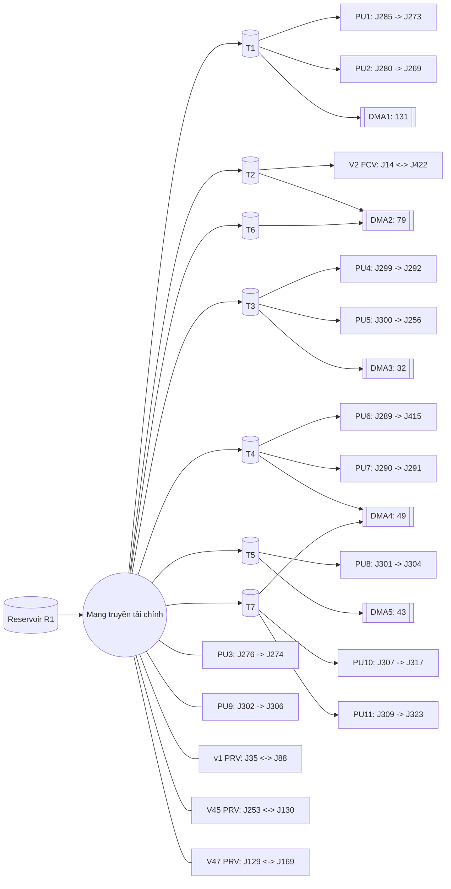
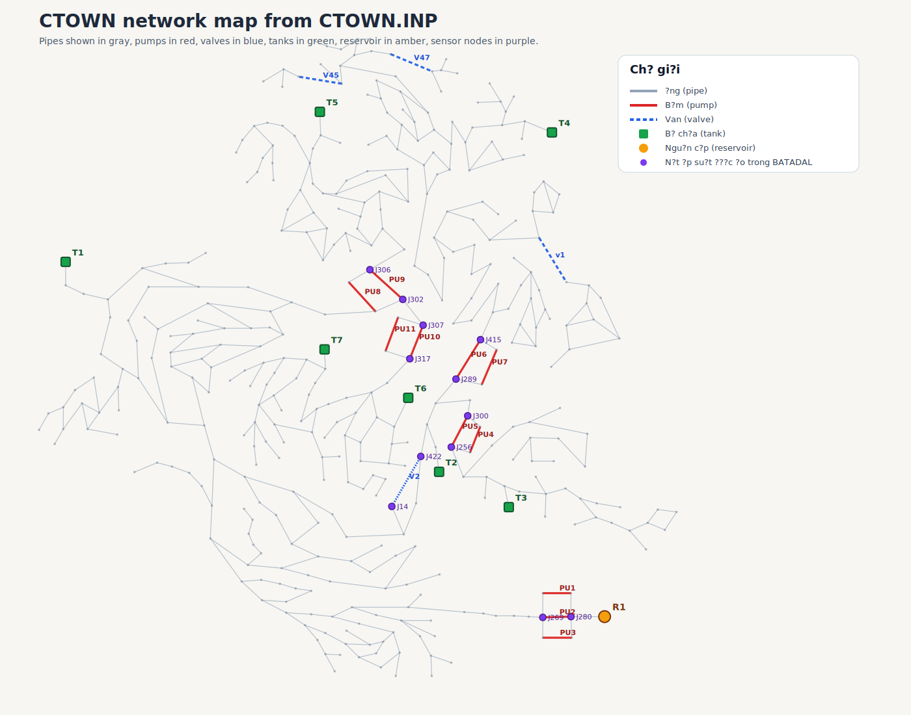

# Mô tả dữ liệu Điện và Nước

Tài liệu này mô tả các bộ dữ liệu chính đang có trong thư mục [dataset](dataset), ý nghĩa của từng bộ và các điểm bất thường cần lưu ý trước khi xử lý.

## 1. Tổng quan dữ liệu chính

| Nhóm | File | Kích thước (bytes) | Vai trò |
|---|---|---:|---|
| Điện (UCI) | [dataset/electricityloaddiagrams20112014/LD2011_2014.txt](dataset/electricityloaddiagrams20112014/LD2011_2014.txt) | 710,998,915 | Nguồn dữ liệu điện chính |
| Điện (Tài liệu) | [dataset/electricityloaddiagrams20112014/README.txt](dataset/electricityloaddiagrams20112014/README.txt) | 594 | Mô tả đơn vị và lưu ý DST |
| Nước (BATADAL) | [dataset/BATADAL_dataset03.csv](dataset/BATADAL_dataset03.csv) | 2,940,389 | Dữ liệu vận hành nền (ATT_FLAG = 0) |
| Nước (BATADAL) | [dataset/BATADAL_dataset04.csv](dataset/BATADAL_dataset04.csv) | 1,225,392 | Dữ liệu có nhãn sự cố một phần |
| Nước (Mô hình mạng) | [dataset/CTOWN.INP](dataset/CTOWN.INP) | 116,999 | Mô hình mạng nước để tham chiếu logic vận hành |

Ghi chú:
- File điện dạng `.csv` và `.xlsx` trong thư mục chỉ là bản bạn đổi định dạng để xem, không dùng làm nguồn chính cho pipeline.

## 2. Dữ liệu điện (nguồn chính: LD2011_2014.txt)

### 2.1 Dữ liệu này là gì

- Dữ liệu phụ tải điện theo thời gian cho 370 công tơ khách hàng (`MT_001` đến `MT_370`).
- Tần suất lấy mẫu: mỗi 15 phút một bản ghi.
- Theo [README](dataset/electricityloaddiagrams20112014/README.txt), giá trị là kW; nếu cần kWh thì chia 4.

### 2.2 Cấu trúc

- Số cột: 371
- 1 cột thời gian + 370 cột công tơ.
- Số dòng dữ liệu: 140,256.
- Mốc thời gian:
	- Bắt đầu: 2011-01-01 00:15:00
	- Kết thúc: 2015-01-01 00:00:00

### 2.3 Định dạng kỹ thuật

- Dấu phân tách cột là `;`.
- Số thập phân dùng dấu `,`.
- Header và timestamp được bọc trong dấu ngoặc kép.
- Ô header đầu tiên bị rỗng (`""`), thực chất là cột thời gian.

### 2.4 Điểm bất thường/cần lưu ý

1. Có nhiều giá trị 0 do một số công tơ được tạo sau năm 2011.
2. Ảnh hưởng DST theo [README](dataset/electricityloaddiagrams20112014/README.txt):
	- Ngày đổi giờ tháng 3 (23 giờ), khung 01:00-02:00 bằng 0.
	- Ngày đổi giờ tháng 10 (25 giờ), khung 01:00-02:00 là giá trị gộp 2 giờ.
3. Header cột thời gian rỗng có thể gây lỗi mapping tên cột nếu không xử lý trước.

## 3. Dữ liệu nước (BATADAL)

### 3.1 Dữ liệu này là gì

- Dữ liệu vận hành mạng cấp nước theo thời gian.
- Bao gồm mức nước (`L_*`), lưu lượng/trạng thái bơm (`F_*`, `S_*`), áp suất (`P_*`) và cờ tấn công/sự cố (`ATT_FLAG`).
- Có thêm [dataset/CTOWN.INP](dataset/CTOWN.INP) để tham chiếu mô hình và logic mạng.

### 3.2 Cấu trúc chung

- Mỗi file có 45 cột.
- Thành phần:
	- `DATETIME`
	- 43 cột cảm biến/cơ cấu chấp hành
	- `ATT_FLAG`

### 3.3 Thống kê theo từng file

| File | Số dòng | Khoảng thời gian | Phân bố ATT_FLAG |
|---|---:|---|---|
| [dataset/BATADAL_dataset03.csv](dataset/BATADAL_dataset03.csv) | 8,761 | 06/01/14 00 đến 06/01/15 00 | 0: 8,761 |
| [dataset/BATADAL_dataset04.csv](dataset/BATADAL_dataset04.csv) | 4,177 | 04/07/16 00 đến 25/12/16 00 | -999: 3,958; 1: 219 |

### 3.4 Điểm bất thường/cần lưu ý

1. Header của `dataset04` có khoảng trắng sau dấu phẩy, cần `strip()` tên cột.
2. `ATT_FLAG = -999` xuất hiện nhiều ở `dataset04`, khả năng cao là placeholder/unknown (cần quy ước rõ khi train hoặc đánh giá).
3. Định dạng thời gian BATADAL (`dd/mm/yy HH`) khác với dữ liệu điện (ISO datetime).

## 4. Mô hình mạng nước CTOWN (chi tiết từ file INP)

Phần này trích trực tiếp từ [dataset/CTOWN.INP](dataset/CTOWN.INP) để trực quan hóa kiến trúc vật lý và logic vận hành của mạng nước.

### 4.1 Thành phần hạ tầng

| Thành phần | Số lượng |
|---|---:|
| Junctions | 388 |
| Reservoirs | 1 |
| Tanks | 7 |
| Pipes | 429 |
| Pumps | 11 |
| Valves | 4 |
| Coordinates | 396 |
| Controls | 20 |

Nguồn cấp chính:
- Reservoir: R1 (head = 59)

Các bể chứa:

| Tank | Elevation | Init Level | Min Level | Max Level | Diameter | Min Vol |
|---|---:|---:|---:|---:|---:|---:|
| T1 | 71.5 | 3.0 | 0 | 6.5 | 31.3 | 0 |
| T2 | 65.0 | 0.5 | 0 | 5.9 | 20.78 | 0 |
| T3 | 112.9 | 3.0 | 0 | 6.75 | 13.73 | 0 |
| T4 | 132.5 | 2.5 | 0 | 4.7 | 11.64 | 0 |
| T5 | 105.8 | 1.0 | 0 | 4.5 | 11.89 | 0 |
| T6 | 101.5 | 5.2 | 0 | 5.5 | 8.33 | 0 |
| T7 | 102.0 | 2.5 | 0 | 5.0 | 7.14 | 0 |

### 4.2 Danh sách bơm và van

Bơm:

| Pump | Node đầu | Node cuối | Thiết lập |
|---|---|---|---|
| PU1 | J285 | J273 | HEAD 8 |
| PU2 | J280 | J269 | HEAD 8 |
| PU3 | J276 | J274 | HEAD 8 |
| PU4 | J299 | J292 | HEAD 9 |
| PU5 | J300 | J256 | HEAD 9 |
| PU6 | J289 | J415 | HEAD 10 |
| PU7 | J290 | J291 | HEAD 10 |
| PU8 | J301 | J304 | HEAD 9 |
| PU9 | J302 | J306 | HEAD 9 |
| PU10 | J307 | J317 | HEAD 11 |
| PU11 | J309 | J323 | HEAD 11 |

Van:

| Valve | Node đầu | Node cuối | Đường kính | Loại | Setting |
|---|---|---|---:|---|---:|
| v1 | J35 | J88 | 203.2 | PRV | 40 |
| V45 | J253 | J130 | 152.4 | PRV | 40 |
| V47 | J129 | J169 | 101.6 | PRV | 40 |
| V2 | J14 | J422 | 254.0 | FCV | 200 |

### 4.3 Logic điều khiển mực nước (Controls)

Các link được đóng/mở theo mức nước bể:

| Link | Điều kiện mở | Điều kiện đóng |
|---|---|---|
| PU1 | T1 < 4.0 | T1 > 6.3 |
| PU2 | T1 < 1.0 | T1 > 4.5 |
| V2 | T2 < 0.5 | T2 > 5.5 |
| PU4 | T3 < 3.0 | T3 > 5.3 |
| PU5 | T3 < 1.0 | T3 > 3.5 |
| PU6 | T4 < 2.0 | T4 > 3.5 |
| PU7 | T4 < 3.0 | T4 > 4.5 |
| PU8 | T5 < 1.5 | T5 > 4.0 |
| PU10 | T7 < 2.5 | T7 > 4.8 |
| PU11 | T7 < 1.0 | T7 > 3.0 |

Trạng thái ban đầu trong section STATUS:
- Đa số bơm và van có trong danh sách được đặt Closed lúc bắt đầu mô phỏng.

### 4.4 Phân vùng nhu cầu (DMA) theo Junction Pattern

| Pattern | Số junction |
|---|---:|
| DMA1_pat | 131 |
| DMA2_pat | 79 |
| DMA3_pat | 32 |
| DMA4_pat | 49 |
| DMA5_pat | 43 |

### 4.5 Sơ đồ trực quan chi tiết



---

## 5. Data Contract: CSV → Kafka JSON Payload [DE-103]

### 5.1 JSON Payload Format (Bronze Layer)

Mỗi dòng CSV được serialize thành một JSON message bắn vào topic `water_stream`. Cấu trúc đầy đủ:

```json
{
  "timestamp": "2014-01-06T00:00:00Z",
  "L_T1": 0.5097,
  "L_T2": 2.049,
  "L_T3": 3.1911,
  "L_T4": 2.7926,
  "L_T5": 2.6561,
  "L_T6": 5.3168,
  "L_T7": 1.5623,
  "F_PU1": 98.998,
  "S_PU1": 1,
  "F_PU2": 99.018,
  "S_PU2": 1,
  "F_PU3": 0.0,
  "S_PU3": 0,
  "F_PU4": 35.537,
  "S_PU4": 1,
  "F_PU5": 0.0,
  "S_PU5": 0,
  "F_PU6": 0.0,
  "S_PU6": 0,
  "F_PU7": 49.809,
  "S_PU7": 1,
  "F_PU8": 34.351,
  "S_PU8": 1,
  "F_PU9": 0.0,
  "S_PU9": 0,
  "F_PU10": 30.513,
  "S_PU10": 1,
  "F_PU11": 0.0,
  "S_PU11": 0,
  "F_V2": 81.605,
  "S_V2": 1,
  "P_J280": 2.974,
  "P_J269": 33.506,
  "P_J300": 26.426,
  "P_J256": 87.606,
  "P_J289": 26.496,
  "P_J415": 84.207,
  "P_J302": 18.902,
  "P_J306": 81.984,
  "P_J307": 18.792,
  "P_J317": 67.126,
  "P_J14": 29.387,
  "P_J422": 28.487,
  "ATT_FLAG": 0
}
```

### 5.2 Schema Definition (PySpark StructType)

Dùng trực tiếp trong Spark Structured Streaming để parse JSON từ Kafka:

```python
from pyspark.sql.types import StructType, StructField, StringType, FloatType, IntegerType

WATER_SCHEMA = StructType([
    StructField("timestamp", StringType(), True),
    # Tank levels
    StructField("L_T1",  FloatType(), True),
    StructField("L_T2",  FloatType(), True),
    StructField("L_T3",  FloatType(), True),
    StructField("L_T4",  FloatType(), True),
    StructField("L_T5",  FloatType(), True),
    StructField("L_T6",  FloatType(), True),
    StructField("L_T7",  FloatType(), True),
    # Pump flows & statuses
    StructField("F_PU1",  FloatType(),   True),
    StructField("S_PU1",  IntegerType(), True),
    StructField("F_PU2",  FloatType(),   True),
    StructField("S_PU2",  IntegerType(), True),
    StructField("F_PU3",  FloatType(),   True),
    StructField("S_PU3",  IntegerType(), True),
    StructField("F_PU4",  FloatType(),   True),
    StructField("S_PU4",  IntegerType(), True),
    StructField("F_PU5",  FloatType(),   True),
    StructField("S_PU5",  IntegerType(), True),
    StructField("F_PU6",  FloatType(),   True),
    StructField("S_PU6",  IntegerType(), True),
    StructField("F_PU7",  FloatType(),   True),
    StructField("S_PU7",  IntegerType(), True),
    StructField("F_PU8",  FloatType(),   True),
    StructField("S_PU8",  IntegerType(), True),
    StructField("F_PU9",  FloatType(),   True),
    StructField("S_PU9",  IntegerType(), True),
    StructField("F_PU10", FloatType(),   True),
    StructField("S_PU10", IntegerType(), True),
    StructField("F_PU11", FloatType(),   True),
    StructField("S_PU11", IntegerType(), True),
    # Valve flow & status
    StructField("F_V2", FloatType(),   True),
    StructField("S_V2", IntegerType(), True),
    # Junction pressures
    StructField("P_J280", FloatType(), True),
    StructField("P_J269", FloatType(), True),
    StructField("P_J300", FloatType(), True),
    StructField("P_J256", FloatType(), True),
    StructField("P_J289", FloatType(), True),
    StructField("P_J415", FloatType(), True),
    StructField("P_J302", FloatType(), True),
    StructField("P_J306", FloatType(), True),
    StructField("P_J307", FloatType(), True),
    StructField("P_J317", FloatType(), True),
    StructField("P_J14",  FloatType(), True),
    StructField("P_J422", FloatType(), True),
    # Label
    StructField("ATT_FLAG", IntegerType(), True),
])
```

### 5.3 Quy tắc chuyển đổi từ CSV sang JSON

| CSV column | JSON key | Kiểu CSV gốc | Kiểu JSON | Ghi chú |
|---|---|---|---|---|
| `DATETIME` | `timestamp` | `dd/mm/yy HH` | ISO 8601 string `YYYY-MM-DDTHH:00:00Z` | Parse bằng `datetime.strptime(v, "%d/%m/%y %H")` |
| `L_T*` | giữ nguyên | string | `float` | Mực nước bể (m) |
| `F_PU*`, `F_V2` | giữ nguyên | string | `float` | Lưu lượng (L/h) |
| `S_PU*`, `S_V2` | giữ nguyên | string | `int` | 0 = off, 1 = on |
| `P_J*` | giữ nguyên | string | `float` | Áp suất (m) |
| `ATT_FLAG` | giữ nguyên | string | `int` | 0 = bình thường, 1 = tấn công, -999 = unknown (dataset04) |

### 5.4 Chiến lược phân tầng dữ liệu (Bronze / Silver)

| Tầng | Nơi lưu | Mô tả |
|---|---|---|
| **Bronze** | Kafka topic `water_stream` | Raw JSON payload — dữ liệu gốc, chưa xử lý, giữ nguyên giá trị kể cả `-999` và null |
| **Silver** | InfluxDB measurement `water_telemetry` | Dữ liệu đã clean: null và `-999` được drop/impute, timestamp đã parse sang `TimestampType`, kiểu dữ liệu đúng, sẵn sàng để query và visualize |
| **Gold** (alert) | InfluxDB measurement `water_alerts` | Output của anomaly detection: chỉ ghi các record có cờ bất thường, kèm field `alert_type` |

### 4.6 Bản đồ 2D theo tọa độ thật của mạng

Hình dưới đây được dựng trực tiếp từ section `COORDINATES` và các liên kết trong `PIPES`, `PUMPS`, `VALVES` của [dataset/CTOWN.INP](dataset/CTOWN.INP).



Diễn giải nhanh:
- Đường màu xám: 429 tuyến ống chính/phụ.
- Đường màu đỏ: 11 liên kết bơm.
- Đường màu xanh dương nét đứt: 4 van điều áp/điều tiết.
- Hình vuông xanh lá: 7 bể T1-T7.
- Hình tròn vàng: nguồn cấp R1.
- Các nút màu tím: các nút đang được đo áp suất trong BATADAL.

Ý nghĩa của bản đồ này:
- Đây là view gần với bố trí vật lý của mạng hơn flowchart ở trên.
- Dễ nhìn ra các cụm tài sản đang được BATADAL theo dõi trực tiếp.
- Hữu ích khi giải thích vì sao một cảnh báo áp suất hoặc trạng thái bơm xuất hiện theo từng vùng.

## 5. Liên hệ trực tiếp giữa BATADAL CSV và CTOWN.INP

Các cột BATADAL bám sát thành phần mạng trong INP:

- Mực nước bể: L_T1 đến L_T7 tương ứng 7 bể T1 đến T7.
- Bơm: F_PU1 đến F_PU11 (lưu lượng) và S_PU1 đến S_PU11 (trạng thái) tương ứng PU1 đến PU11.
- Van: F_V2 và S_V2 tương ứng van V2 (FCV) trong INP.
- Áp suất nút: P_J280, P_J269, P_J300, P_J256, P_J289, P_J415, P_J302, P_J306, P_J307, P_J317, P_J14, P_J422.
- Nhãn: ATT_FLAG.

Đối chiếu cụ thể giữa asset và sensor áp suất:

| Cụm tài sản | Node áp suất liên quan trong BATADAL | Ý nghĩa |
|---|---|---|
| PU2: J280 -> J269 | P_J280, P_J269 | Áp suất hai đầu cụm bơm PU2 |
| PU5: J300 -> J256 | P_J300, P_J256 | Áp suất trước/sau cụm bơm PU5 |
| PU6: J289 -> J415 | P_J289, P_J415 | Áp suất quanh cụm bơm PU6 |
| PU9: J302 -> J306 | P_J302, P_J306 | Áp suất hai đầu cụm bơm PU9 |
| PU10: J307 -> J317 | P_J307, P_J317 | Áp suất hai đầu cụm bơm PU10 |
| V2: J14 -> J422 | P_J14, P_J422 | Áp suất hai đầu van điều tiết V2 |

Nhận xét thêm:
- Không phải mọi bơm/van trong INP đều có cặp sensor áp suất riêng trong BATADAL.
- BATADAL tập trung vào một số cụm vận hành quan trọng thay vì đo áp suất toàn mạng.
- PU3 và PU9 có xuất hiện trong BATADAL ở mức lưu lượng/trạng thái bơm, nhưng không phải asset nào cũng có rule điều khiển mức bể đi kèm trong section `CONTROLS`.

Ý nghĩa thực tế:
- Có thể dùng INP để giải thích hành vi time-series trong BATADAL theo logic thủy lực và control level.
- Khi phát hiện bất thường, nên đối chiếu đồng thời mực bể, trạng thái bơm/van và áp suất các nút liên quan.

## 6. Kết luận và lưu ý triển khai

- Bộ dữ liệu hiện tại đủ để làm luồng điện + nước và có cả mô hình CTOWN để giải thích vận hành.
- Với dữ liệu điện, chỉ nên dùng một nguồn chính là [dataset/electricityloaddiagrams20112014/LD2011_2014.txt](dataset/electricityloaddiagrams20112014/LD2011_2014.txt).
- Rủi ro lớn nhất nằm ở chuẩn hóa định dạng và quy ước nhãn:
	- Điện: delimiter `;`, decimal `,`, timestamp và DST.
	- Nước: khoảng trắng header, định dạng datetime, ý nghĩa ATT_FLAG = -999.
